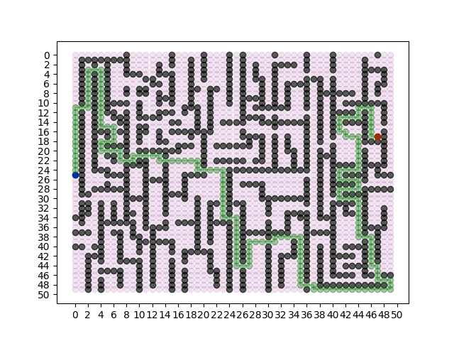

# A*, Weighted A* and Anytime Weighted A* Implementations

## Note
You can make changes to the driver.py files to modify the problem to your liking. 
In the map, the **'#'** are obstacles and **' '** are non-occupied, traversable grids.

## Execution
I personally reccommend using an IDE to execute this code. But you can directly run driver.py in a terminal, and it should work just fine. 

In the terminal window:
1. cd into the folder with this code.
2. run the command 'python3 driver.py'

## Sample Output

